# Architecture: Study Skills Builder — Multi-Agent DCS System

## System Overview

Study Skills Builder implements a **Distributed Cognitive Scaffolding (DCS) Pipeline** — a hierarchical multi-agent system combining rule-based signal extraction, parallel specialist LLMs, and a streaming synthesis orchestrator. Every chat interaction flows through 5 sequential stages; check-in submission drives a separate autonomous skill advancement pipeline; a cron-scheduled agent handles proactive nudges.

---

## Architecture Diagram

```mermaid
flowchart LR
    User(["👤 Student"])
    DB[("🗄️ PostgreSQL")]

    %% Input
    Voice["🎙️ Voice\nWhisper-large-v3"]
    CheckIn["📋 Daily Check-in"]
    Chat["💬 AI Chat"]

    %% DCS steps as standalone nodes
    CTX["① Context Builder\nFull student profile\nfrom DB"]
    SEN["② Sentinels\nRule-based, no LLM\nBehavior · Cognitive\nMetacognitive"]
    COACHES["③ Specialist Coaches\nRun in parallel\nBehavioral · Cognitive\nMetacognitive · Mindset"]
    ORCH["④ Orchestrator\nllama-3.3-70b\nSynthesises insights\nStreams response"]
    KA["⑤ Knowledge Analyzer\nBackground agent\nTracks subject mastery"]

    %% Progression
    STAB["Stability Score\n40% initiation\n60% focus"]
    ADV["Week Advancement\nWeek 1: 4/7 days started\nWeek 2: 5/7 days focused\nWeek 3: score ≥ 0.7"]
    UNLOCK["🔓 Level Unlock\nAll 3 skills stable\n→ auto-activates next"]

    %% Notifications
    GEN["Notification Agent\nllama-3.3-70b\nDaily nudge · Weekly insight"]
    PUSH["🔔 Web Push\nVAPID"]
    CRON(["⏰ Daily Cron"])

    %% Input layer
    User -->|"speaks"| Voice
    User -->|"submits"| CheckIn
    User -->|"messages"| Chat
    Voice -->|"transcript"| Chat
    Voice -->|"transcript"| CheckIn

    %% DCS pipeline (chat)
    Chat -->|"POST"| CTX
    CTX -->|"read"| DB
    CTX --> SEN --> COACHES --> ORCH
    ORCH -->|"stream"| Chat
    ORCH -->|"save task"| DB
    ORCH --> KA
    KA -->|"update"| DB

    %% Check-in progression
    CheckIn -->|"save"| DB
    CheckIn --> STAB --> ADV --> UNLOCK
    UNLOCK -->|"activate"| DB

    %% Notifications
    CRON --> GEN
    GEN -->|"read"| DB
    GEN --> PUSH -->|"notify"| User

    %% Styling
    style CTX fill:#1e3a5f,stroke:#38bdf8,color:#e2e8f0
    style SEN fill:#1e3a5f,stroke:#38bdf8,color:#e2e8f0
    style COACHES fill:#1e3a5f,stroke:#38bdf8,color:#e2e8f0
    style ORCH fill:#1e3a5f,stroke:#38bdf8,color:#e2e8f0
    style KA fill:#1e3a5f,stroke:#38bdf8,color:#e2e8f0

    style STAB fill:#14532d,stroke:#4ade80,color:#e2e8f0
    style ADV fill:#14532d,stroke:#4ade80,color:#e2e8f0
    style UNLOCK fill:#14532d,stroke:#4ade80,color:#e2e8f0

    style GEN fill:#713f12,stroke:#fbbf24,color:#e2e8f0
    style PUSH fill:#713f12,stroke:#fbbf24,color:#e2e8f0

    style Voice fill:#3b1d6e,stroke:#a855f7,color:#e2e8f0
    style CheckIn fill:#3b1d6e,stroke:#a855f7,color:#e2e8f0
    style Chat fill:#3b1d6e,stroke:#a855f7,color:#e2e8f0
    style DB fill:#0f172a,stroke:#64748b,color:#94a3b8
```



---

## Components

| Component | Type | Model / Tech | Autonomous Decisions |
|-----------|------|-------------|---------------------|
| Context Builder | Orchestration | Prisma — 8 parallel queries | Assembles complete user state once per request |
| Behavior Sentinel | Rule-based agent | TypeScript | Procrastination type (emotional vs logistical), initiation rate |
| Cognitive Sentinel | Rule-based agent | TypeScript | Best study method (focus correlation), 7-day focus rate |
| Metacognitive Sentinel | Rule-based agent | TypeScript | Event urgency, days to nearest deadline |
| Fixed-Mindset Detector | Rule-based | Regex | Conditional trigger for MindsetInterventionAgent |
| BehavioralCoach | Specialist LLM | llama-3.1-8b-instant | Interprets initiation weakness, task scope signals |
| CognitiveCoach | Specialist LLM | llama-3.1-8b-instant | Interprets focus capacity, energy and mood patterns |
| MetacognitiveCoach | Specialist LLM | llama-3.1-8b-instant | Interprets event anchoring, pre-session intention usage |
| MindsetInterventionAgent | Conditional LLM | llama-3.1-8b-instant | Selects evidence-based reframing angle |
| Orchestrator | Synthesis LLM | llama-3.3-70b-versatile | Most Efficient Insight selection, streaming, tool calls |
| Knowledge Analyzer | Background LLM | llama-3.1-8b-instant | Subject / topic / mastery extraction after every exchange |
| Stability Calculator | Deterministic | TypeScript | Scores 0.4 × initiation + 0.6 × focus |
| Week Advancement | Rule-based | TypeScript | Advances skill week when behavioral thresholds met |
| Level Unlock | Autonomous trigger | TypeScript | Activates next skill level when all 3 current skills stabilize |
| Notification Generator | Scheduled LLM | llama-3.3-70b-versatile | Personalized daily nudge and weekly insight via cron |
| Voice Transcription | Tool | Groq Whisper-large-v3 | Converts audio to text in both English and Arabic |

---

## Memory

| Memory Type | Storage | Contents |
|------------|---------|----------|
| Long-term behavioral | `CheckIn` table | Study session data — initiated, focus, energy, mood, methods, miss reason (14-day window) |
| Skill state | `SkillProgress` table | Week phase, stability score, user-defined task, status per skill |
| Episodic / subject knowledge | `KnowledgeEntry` table | Subject + topic + mastery status updated silently after every conversation (last 30) |
| Conversational context | `ChatMessage` table | Last 20 messages used as chat history window |
| User profile | `UserProfile` table | Coaching style preference, motivation frame, self-assessment, phone usage |
| Event anchors | `Event` table | Upcoming exams, quizzes, deadlines — used by Metacognitive Sentinel |

---

## Interaction Flow

```
Student message (typed or voice-transcribed)
  → POST /api/chat { message, chatMode }

  1. Auth check (NextAuth session)
  2. Fetch last 20 ChatMessages
  3. Save user message to DB
  4. runDCSPipeline():
       a. Context Builder: 8 parallel Prisma queries → UserData
       b. buildContextFromData() → 250-line user state string
       c. Sentinels: parse 14 check-ins → BehaviorSignals + CognitiveSignals + MetacognitiveSignals
       d. Fixed-mindset detector runs on message text
       e. Parallel coaches: Promise.all([BehavioralCoach, CognitiveCoach, MetacognitiveCoach, MindsetAgent?])
       f. Orchestrator: system prompt + context + coach outputs → stream via SSE
          └─ If update_skill_task tool call detected: execute → DB upsert → follow-up confirmation
       g. Knowledge Analyzer: fire-and-forget (never blocks response)
  5. Save assistant response to ChatMessage

SSE events received by client:
  data: { step: "sentinels" }
  data: { step: "coaches" }
  data: { step: "orchestrating" }
  data: { text: "..." }          ← streaming response chunks
  data: { action: "task_updated", task: "..." }   ← if skill task updated
  data: [DONE]
```

---

## Key Design Decisions

- **Sentinels first, LLMs second** — Rule-based agents extract structured signals at zero LLM cost before any model is invoked. This keeps latency low and signals deterministic.
- **Parallel specialists, not one big prompt** — Each coach focuses on one dimension. Failures are isolated. The orchestrator synthesizes rather than multi-tasks.
- **Fire-and-forget background work** — Knowledge analysis and post-processing never block the streaming response.
- **Atypical override** — Students can mark any day as atypical; those check-ins are excluded from stability scoring. The agent never penalizes life context.
- **Tool use closes the loop** — `update_skill_task` lets the conversation directly modify the student's active skill target in the database — not just advice, actual state change.
